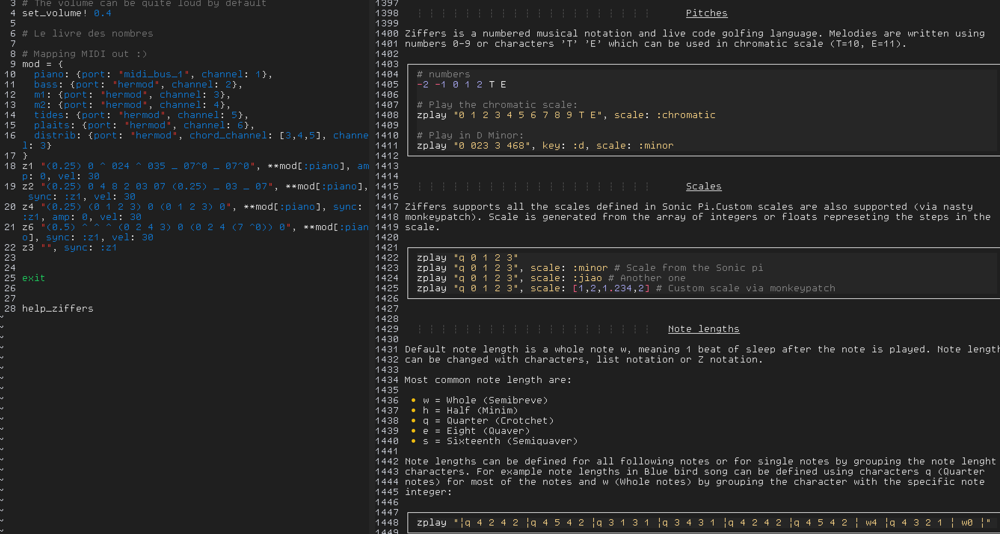

# Sonic Pipe

**This program is still highly unstable/experimental. The program is not yet properly packaged for easy distribution/installation. Use with caution, feel free to jump in and help :).**

I couldn't wait for a new version of [sonic-pi-cli](https://github.com/Widdershin/sonic-pi-cli) or [sonic-pi-tool](https://github.com/lpil/sonic-pi-tool) following the release of Sonic Pi 4.0 so I quickly hacked a CLI tool that allows strings to be piped from the command line to the Sonic Pi Server. The script is a proof of concept based on information gathered from the [Sonic Pi Forum](https://in-thread.sonic-pi.net/). Feel free to change anything and to push changes to the repo :). I don't pretend to replace or do better than the tools mentioned above. Use them if you can once they will be updated!

## TODO list

* Control logs verbosity (less printing)
* Restore Ableton Link functionality (??)
* Subfolders for help system
* Remove unused files
* Make the script available for Windows (??)

## Usage

* Install the tool using the `setup.py` file.
  1. `git clone https://github.com/Bubobubobubobubo/sonic_pipe`
  2. `cd sonic_pipe`
  3. `pip install -e .` or `pip3 install -e .` depending on your Python installation.

Required dependencies will be automatically installed. A CLI tool will be added to your path: `sonic-pipe`. In forward versions, you will also be able to import SonicPipe as a library for usage in your own Python programs.

In order to use Sonic Pipe, you will need a tool able to pipe commands from a terminal buffer to another terminal buffer. I recommend using Vim/Neovim [Slime plugin](https://github.com/jpalardy/vim-slime). Very easy to setup and straightforward to use.

## Commands

Some basic commands are available:

* **stop** : stop currently running code.
* **exit** : exit the REPL/CLI tool.
* **help** : display help files.

Sonic Pipe includes an auto-save tool for your Sonic Pipe sessions. Sessions will be automatically saved whatever happens as `.rb` files located at `$HOME/.sonic-pi/sonic-pipe-sessions/`. Files are named in accordance with the current local time of your computer for easy retrieval.

* **history** : print current session history.
* **purge-history** : delete all files from history.
* **save-history** : save the current Sonic Pipe session.

## Help System

Sonic Pipe includes an embedded documentation system that you can invoke directly from your playing buffer. Some help files are installed by default with the package. Your own help files can be added to SonicPipe by placing them in the `$HOME/.sonic-pi/sonic-pipe-help/` folder in the MarkDown format. This
functionality is helpful to add custom documentation to your own libraries or to save code snippets that you wish to retrieve quickly.

* **help** : display the list of available help files.
* **help [name]** : print the selected help file.